# UML & System Diagrams - AgroConnect Project
**BE Sem 8 College Report**  
**Project:** AgroConnect E-Commerce Platform  
**Generated:** Auto-generated comprehensive diagrams based on Django models and PROJECT_REPORT.md  

---

## 1. Use Case Diagram
**Actors:** Customer, Farmer, Admin, Guest  
**Primary Use Cases:**

```mermaid
graph TD
    A[Customer] --> B[View Products]
    A --> C[Search Products]
    A --> D[Add to Cart]
    A --> E[Manage Wishlist]
    A --> F[Checkout & Order]
    A --> G[Chat with Bot]
    A --> H[Manage Addresses]
    
    I[Farmer] --> J[Register as Farmer]
    I --> K[Manage Products]
    I --> L[View Orders]
    I --> M[Update Order Status]
    
    N[Admin] --> O[Manage Dashboard]
    N --> P[CRUD Categories]
    N --> Q[CRUD Products]
    N --> R[Manage All Orders]
    N --> S[Site Settings]
    
    T[Guest] --> B
    T --> C
    T --> U[Register/Login]
    
    style A fill:#e1f5fe
    style I fill:#f3e5f5
    style N fill:#fff3e0
```

**Descriptions:**
| Use Case | Pre-condition | Post-condition | Actors |
|----------|---------------|----------------|--------|
| View Products | None | Product list displayed | Customer, Guest |
| Checkout | Items in cart | Order created, payment initiated | Customer |
| Manage Products | Farmer login | Product updated in DB | Farmer |
| Manage Orders | Admin login | Order status updated | Admin |

---

## 2. Data Flow Diagrams (DFD)

### Level 0: Context Diagram
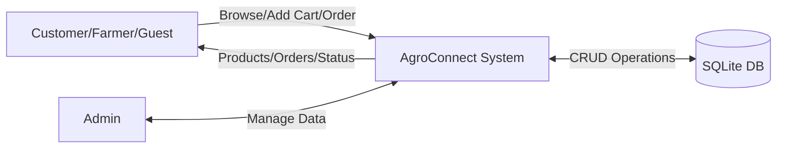

### Level 1: Main Processes
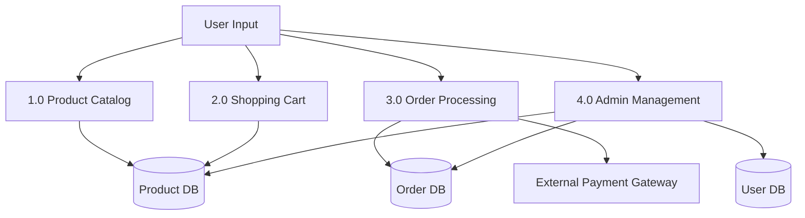

### Level 2: Order Processing
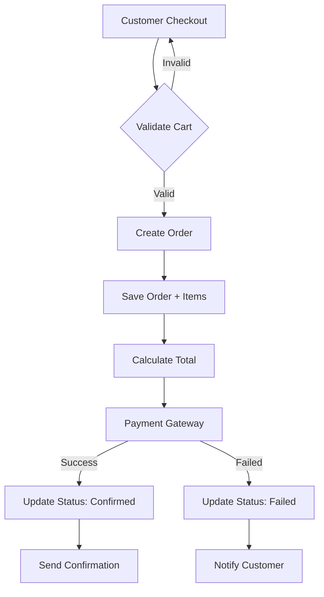

**ASCII Level 2 Alternative:**
```
Customer → Validate Cart → Create Order Record → DB
                    ↓
              Payment Gateway (Razorpay)
                    ↓
              Update Order Status → Email Notification
```

---

## 3. Entity-Relationship (ER) Diagram
**Based on DATA_DICTIONARY.md models**

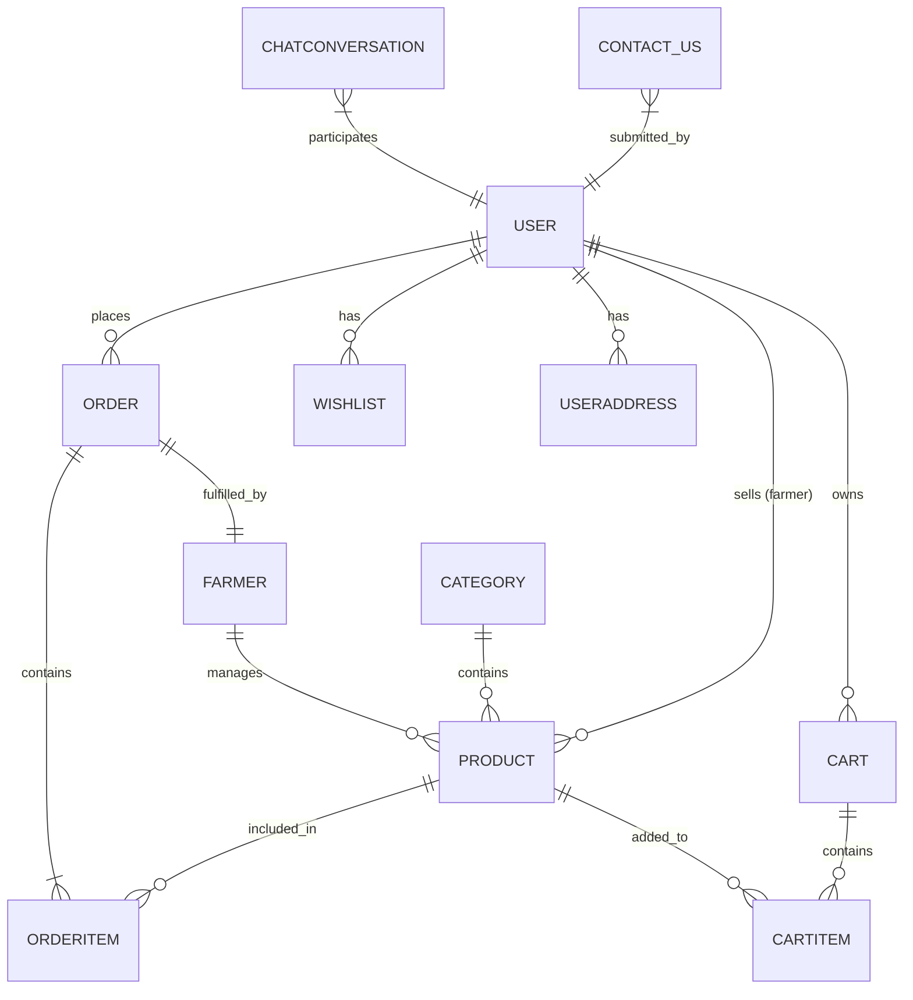

**Key Relationships:**
- Product belongs to Category (N:1)
- Order contains OrderItems (1:N)
- User has multiple Addresses (1:N)
- Farmer-User OneToOne

---

## 4. Class Diagram (Django Models)
**Key Classes with Attributes & Methods**

```mermaid
classDiagram
    class User {
        +id: int PK
        +username: str
        +email: str
        +is_staff: bool
        +authenticate()
        +login()
    }
    
    class Farmer {
        +id: int PK
        +user: User 1:1
        +name: str
        +phone: str
        +is_active: bool
        +create_product()
    }
    
    class Product {
        +id: int PK
        +name: str
        +price: Decimal
        +category: Category FK
        +farmer: Farmer FK
        +stock: int
        +image: ImageField
        +get_price()
        +update_stock()
    }
    
    class Category {
        +id: int PK
        +name: str
        +description: Text
        +products: List~Product~
    }
    
    class Order {
        +id: int PK
        +order_number: str
        +user: User FK
        +farmer: Farmer FK
        +total: Decimal
        +status: str
        +process_payment()
        +update_status()
    }
    
    class OrderItem {
        +id: int PK
        +order: Order FK
        +product: Product FK
        +quantity: int
        +calculate_subtotal()
    }
    
    User <|-- Farmer
    Category ||--o{ Product
    Farmer ||--o{ Product
    User ||--o{ Order
    Order ||--o{ OrderItem
    Product ||--o{ OrderItem
```

---

## 5. Sequence Diagrams

### 5.1 Customer Order Placement (Enhanced)
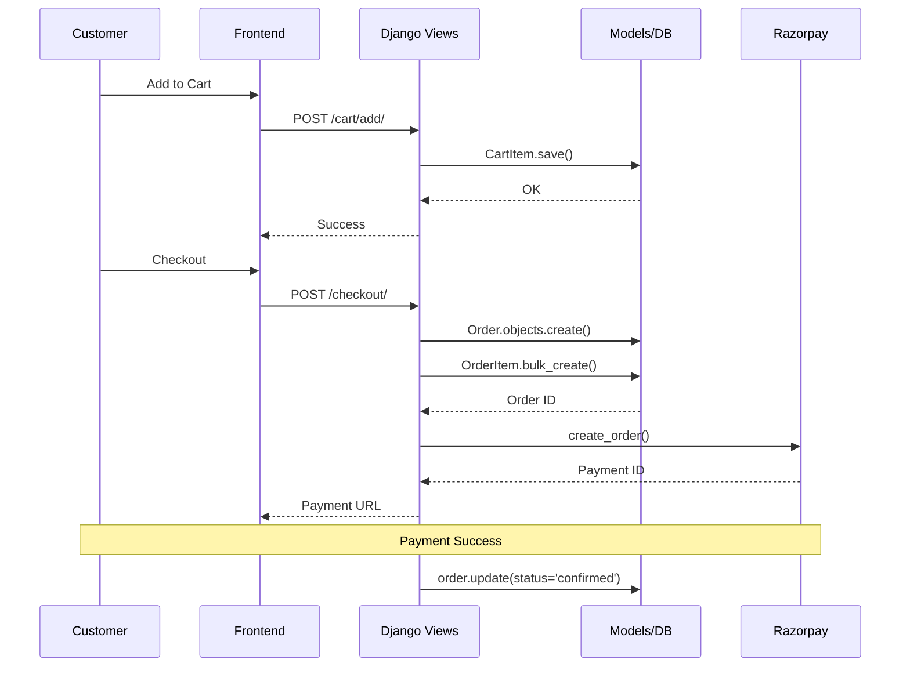

### 5.2 Farmer Add Product
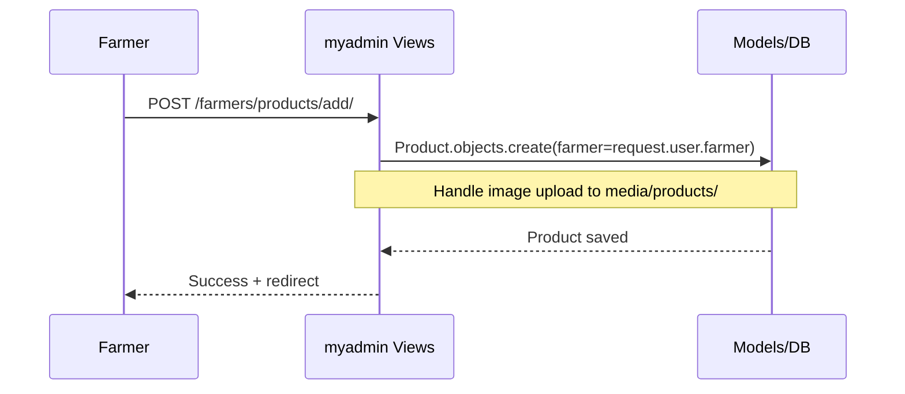

### 5.3 Chatbot Interaction
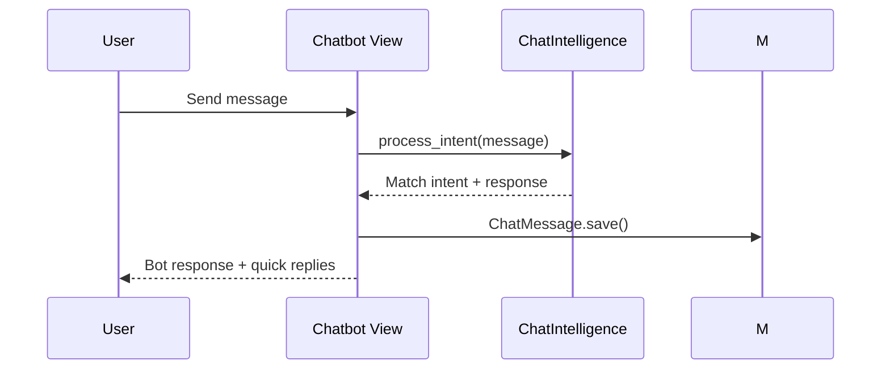

---

## 6. Activity Diagrams

### 6.1 Customer Order Placement
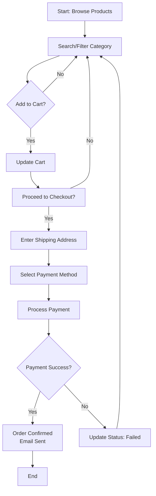

### 6.2 Admin Product Management
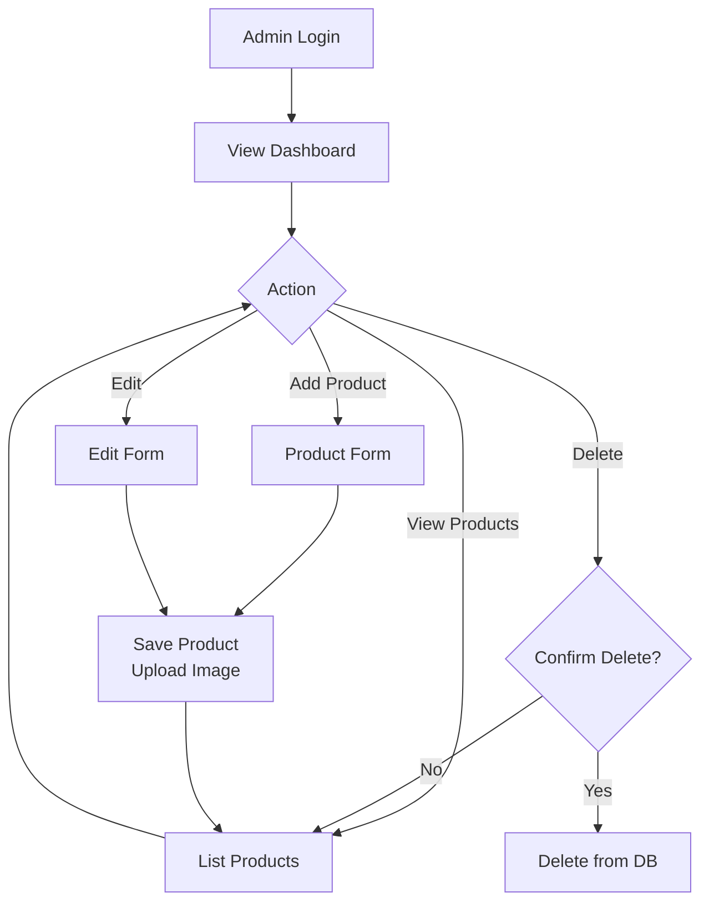

### 6.3 Farmer Registration
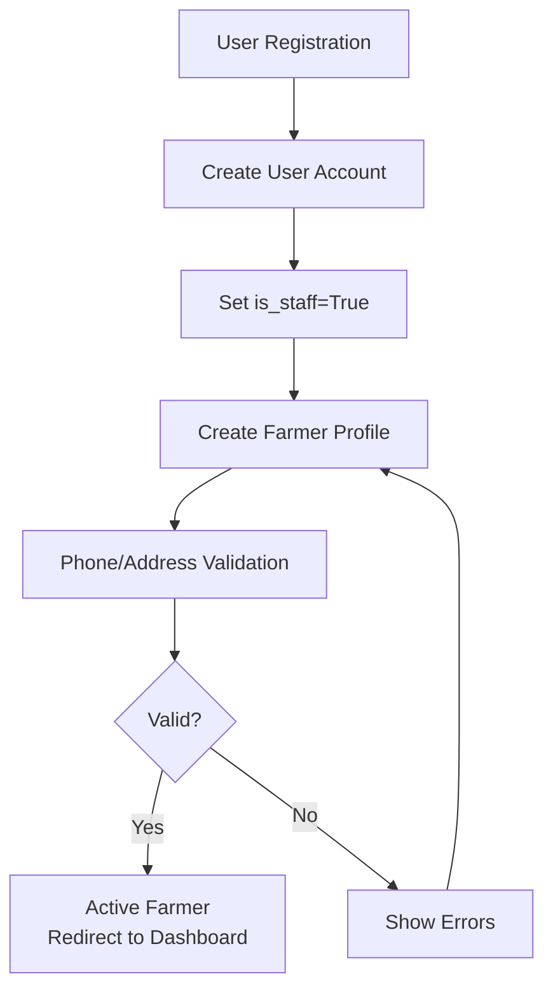

**ASCII Backup for Activity (Order Flow):**
```
[Start] --> [View Products] --> [Add to Cart?] --No--> [Continue Browsing]
                          |
                       Yes
                          v
                    [Update Cart] --> [Checkout?] --No--> [Continue]
                                      |
                                    Yes
                                      v
                           [Enter Details] --> [Payment] --> [Success?] --No--> [Retry]
                                                                    |
                                                                  Yes
                                                                    v
                                                          [Order Confirmed] --> [End]
```

---

## Usage Notes
- **Mermaid Diagrams**: Copy to [Mermaid Live Editor](https://mermaid.live/) or GitHub README for interactive rendering.
- **Print-Ready**: Use Markdown viewer (VS Code, Typora) for report.
- **Based On**: Actual Django models from DATA_DICTIONARY.md and code structure.
- **Customization**: Edit this file directly for your presentation.

**Report Complete! All diagrams generated for BE Sem 8 submission.**
